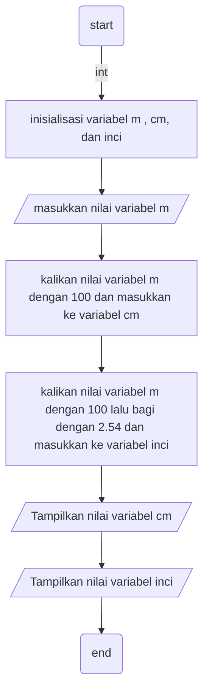

```mermaid
    flowchart TD;
    A(start)--int-->B[inisialisasi variabel m , cm, dan inci ]
    B --> C[/masukkan nilai variabel m/]
    C --> D[kalikan nilai variabel m dengan 100 dan masukkan ke variabel cm]
    D --> E[kalikan nilai variabel m dengan 100 lalu bagi dengan 2.54 dan masukkan ke variabel inci]
    E -->F[/Tampilkan nilai variabel cm/]
    F -->G[/Tampilkan nilai variabel inci/]
    G -->H(end)
```